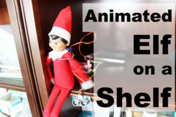

# Elf on a Shelf Project with the PivotPi
PivotPi is a Servo Controller for the Raspberry Pi!

In this project we show you how to Animate an Elf on a Shelf with the PivotPi, a Raspberry Pi Servo Controller, making it a smart Elf.  We'll attach a small servo to the Elf's arm to make it wave, we'll use a distance sensor to see if anyone is close to the Elf on a Shelf, and we will tie it all together with the Raspberry Pi and GrovPi Zero.

See more about the PivotPi: https://www.dexterindustries.com/pivotpi

See the written project here:   https://www.dexterindustries.com/projects/animate-elf-shelf-raspberry-pi-servo-controller

# See More About the PivotPi

See more about the PivotPi Raspberry Pi servo Controller here.  https://www.dexterindustries.com/pivotpi